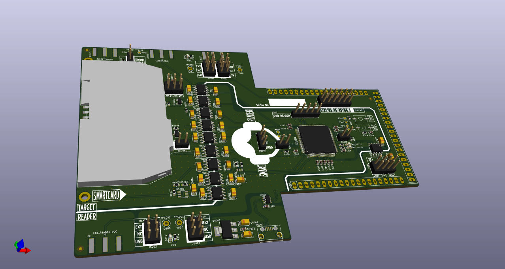
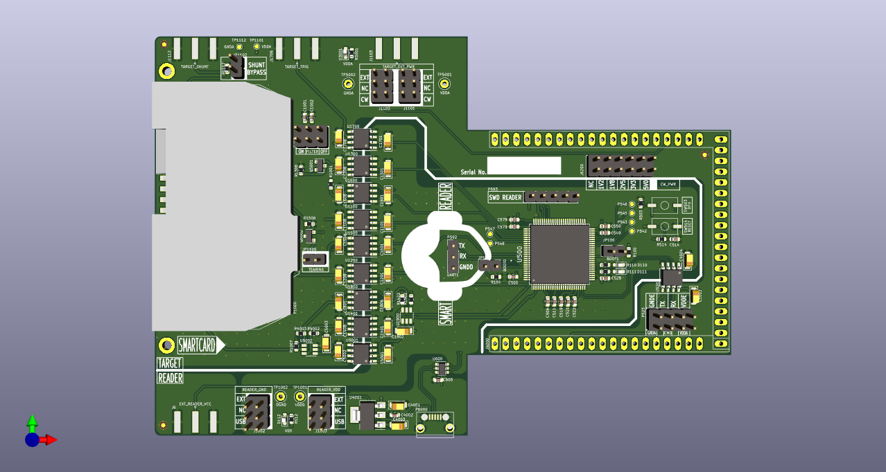
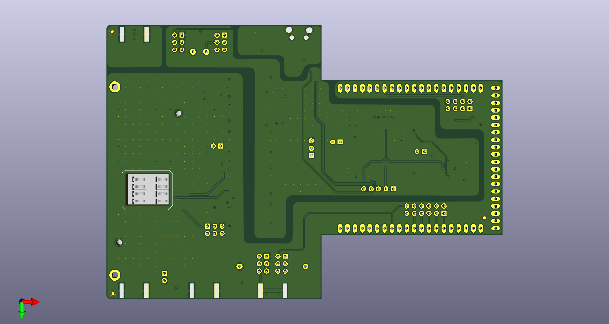

# WooKey Mainboard PCB




## Introduction

 
Leia | https://leia-project.github.io/
Copyright 2018 The leia project team <leia@ssi.gouv.fr>

The Leia from [ANSSI](https://www.ssi.gouv.fr) is an open source
hardware design, implementing an Encrypted Flash Drives.

This repository is aimed towards developers.


### Revision information

This directory contains the hardware design for the Leia board, first public version (Leia V2).


### PCB editing tools

All PCB files (schematic and PCB layout) have been designed using the KiCad EDA.
This Cross Platform and Open Source Electronics Design Automation Suite can be downloaded
on http://kicad-pcb.org/.


## Production files generation 101

### Configure the project

KiCad binaries location may change regarding your operating system.
This is why you have to set your environment.
This is done by sourcing the `setenv.sh` script. This script exports
all paths that are required in order to automaticaly generate the production files.


Most of the time, the paths proposed in this script are not the one you use in your specific installation.
The `setenv.sh` script support easy variables overloading by including a `setenv.local.sh` script file if this file exists in the same directory.
If you need to overload some of the variables of the `setenv.sh` script, just add them to your own `setenv.local.sh` file.
Here is an example to define KiCad environement path on Apple Mac OS.

```
  $ echo "export PYTHON_BIN_PATH = /Applications/KiCad/kicad.app/Contents/Frameworks/Python.framework/Versions/2.7/bin/python" > setenv.local.sh
  $ source setenv.sh
  Loading local SDK settings...
  =========================================================
  === Kicad environment configuration
  =========================================================
  PYTHON_BIN_PATH   = /Applications/KiCad/kicad.app/Contents/Frameworks/Python.framework/Versions/2.7/bin/python
  PYTHON_PATH     = /Applications/Kicad/kicad.app/Contents/Frameworks/python/site-packages
  BOM_GEN_PATH = /Applications/Kicad/kicad.app/Contents/SharedSupport/plugins/bom2grouped_csv.xsl
  TOOLS_PATH = ../../../tools
  =========================================================
```

The production files can be generated using the following command.

```
$ make
```

This will generate the production files in a new sub directory.
The directory name may differ according the project your are working with.


## PCB Pinout


## PCB Layers

### PCB TOP layer



### PCB BOTTOM layer




### Layers

Order and type of copper layers:
  TOP:  signal, front components
  GND:  ground plane
  PWR:  ground and power plane
  BOT:  signal, back components


### Stackup
4 layers, 1.6mm thickness
Outer layers 1 oz base copper foil
Inner layers 0.5 oz base copper foil

Electroless Nickel Immersion Gold (ENIG) surface finish

solder resist   0.0254mm
copper          0.0356mm    L1 (TOP)
FR408 prepreg   0.1702mm
copper          0.0178mm    L2 (GND)
FR408           1.1938mm
copper          0.0178mm    L3 (PWR)
FR408 prepreg   0.1702mm
copper          0.0356mm    L4 (BOT)
solder resist   0.0254mm

The substrate for both the core and prepreg is FR408,
with a dielectric constant of 3.66 at 1GHz.
The prepreg is comprised of 2 layers of Isola 2113.


## Regulatory compliance & handling

The Leia board is intended for use as a development platform for hardware
or software. The board is an open system design, which does not include a
shielded enclosure. This may cause interference to other electrical or
electronic devices in close proximity. In a domestic environment, this product
may cause radio interference in which case the user may be required to take
adequate measures. In addition, this board should not be used near any medical
equipment or RF devices.

The board is sensitive to ESD. Hold the board only by its edges. After removing
the board from its box, place it on a grounded, static-free surface.

The board can become hot, like any fan-less design, during continuous high CPU
loads, mind its temperature while handling it.

## License

Leia | https://leia-project.github.io/
Copyright 2018 The Lia project team <leia@ssi.gouv.fr>

This is an open hardware design licensed under the terms of the CERN Open
Hardware Licence (OHL) v1.2.

You may redistribute and modify this documentation under the terms of the CERN
OHL v.1.2 (http://ohwr.org/cernohl). This documentation is distributed WITHOUT
ANY EXPRESS OR IMPLIED WARRANTY, INCLUDING OF MERCHANTABILITY, SATISFACTORY
QUALITY AND FITNESS FOR A PARTICULAR PURPOSE. Please see the CERN OHL v.1.2 for
applicable conditions.
